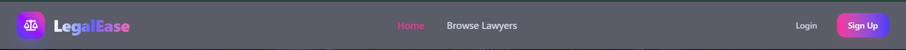
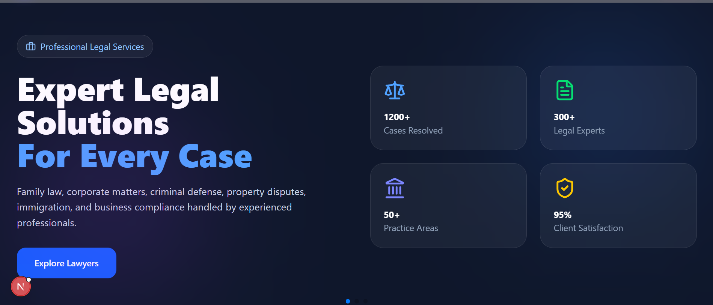
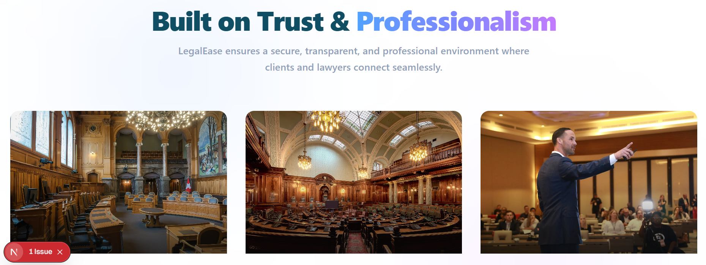
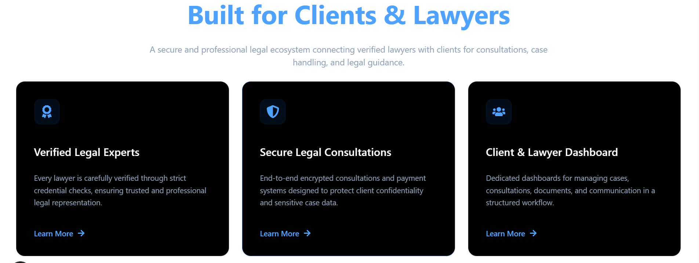
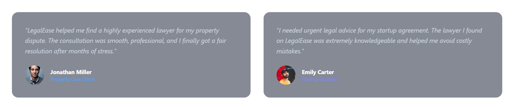
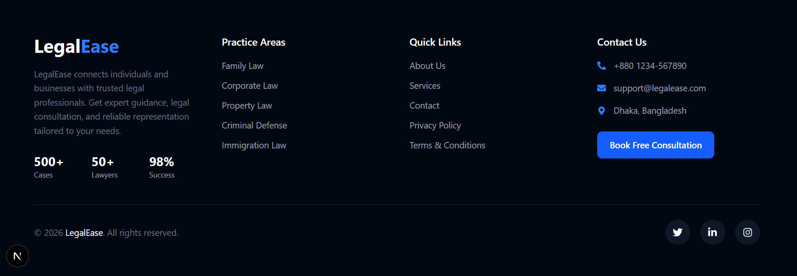
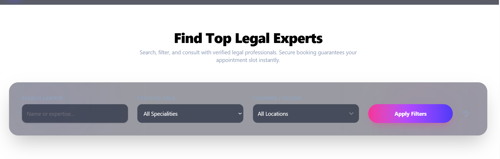

### ⚖️ LegalEase – Smart Legal Service & lawyer Hiring Platform
LegalEase link: https://legal-ease-main.vercel.app


**LegalEase** is a modern, feature-rich legal service platform designed to bridge the gap between clients and professional lawyers. The platform enables users to discover, compare, and hire experienced lawyers based on their specialization, consultation fees, and professional profiles. With an elegant user interface and seamless user experience, LegalEase simplifies the process of finding trusted legal assistance anytime, anywhere.

Built using **Next.js**, **MongoDB**, **Express.js**, **HeroUI**, and secured with **Environment Variables (.env)**, the application delivers a fast, responsive, and scalable experience. Interactive **Swiper.js** sliders and engaging **Animate.css** animations enhance the visual appeal, making the platform both professional and user-friendly.

### ✨ Key Features

🔹 **Role-Based Authentication & Authorization**
Secure login and registration system with different user roles, including Clients and lawyers.

🔹 **lawyer Discovery & Hiring**
Users can browse lawyer profiles, view specializations, consultation fees, experience, and hire lawyers directly from the platform.

🔹 **lawyer Dashboard**
lawyers can manage their legal profiles, update service information, track hiring requests, and monitor client interactions.

🔹 **Premium Membership System**
Integrated premium subscription functionality with payment processing to unlock advanced platform features.

🔹 **Responsive Modern UI**
Crafted with HeroUI components, modern layouts, smooth animations, and mobile-friendly responsiveness.

🔹 **Secure Database Management**
MongoDB ensures reliable storage and management of user profiles, lawyer information, hiring records, and transactions.

🔹 **Interactive User Experience**
Swiper.js powered sliders and Animate.css effects create a visually engaging and dynamic browsing experience.

### 🛠️ Technologies Used

* **Frontend:** Next.js, React.js, HeroUI
* **Backend:** Express.js
* **Database:** MongoDB
* **Authentication:** Secure Role-Based Authentication
* **Animations:** Animate.css
* **Slider & Carousel:** Swiper.js
* **Environment Management:** dotenv (.env)
* **Deployment Ready:** Modern scalable architecture

### 🎯 Project Goal

The primary goal of **LegalEase** is to create a reliable digital legal marketplace where clients can easily find professional legal assistance and lawyers can efficiently manage their services, ultimately making legal support more accessible, transparent, and convenient for everyone.

🚀 **LegalEase – Connecting People with Trusted Legal Professionals.**


<!-- navbar  -->

<!-- banner -->

<!-- extra section -->

<!-- service feature  -->

<!-- appraisal section -->

<!-- footer section  -->

<!-- search  -->



This is a [Next.js](https://nextjs.org) project bootstrapped with [`create-next-app`](https://github.com/vercel/next.js/tree/canary/packages/create-next-app).

## Getting Started

First, run the development server:

```bash
npm run dev
# or
yarn dev
# or
pnpm dev
# or
bun dev
```

Open [http://localhost:3000](http://localhost:3000) with your browser to see the result.

You can start editing the page by modifying `app/page.js`. The page auto-updates as you edit the file.

This project uses [`next/font`](https://nextjs.org/docs/app/building-your-application/optimizing/fonts) to automatically optimize and load [Geist](https://vercel.com/font), a new font family for Vercel.

## Learn More

To learn more about Next.js, take a look at the following resources:

- [Next.js Documentation](https://nextjs.org/docs) - learn about Next.js features and API.
- [Learn Next.js](https://nextjs.org/learn) - an interactive Next.js tutorial.

You can check out [the Next.js GitHub repository](https://github.com/vercel/next.js) - your feedback and contributions are welcome!

## Deploy on Vercel

The easiest way to deploy your Next.js app is to use the [Vercel Platform](https://vercel.com/new?utm_medium=default-template&filter=next.js&utm_source=create-next-app&utm_campaign=create-next-app-readme) from the creators of Next.js.

Check out our [Next.js deployment documentation](https://nextjs.org/docs/app/building-your-application/deploying) for more details.
